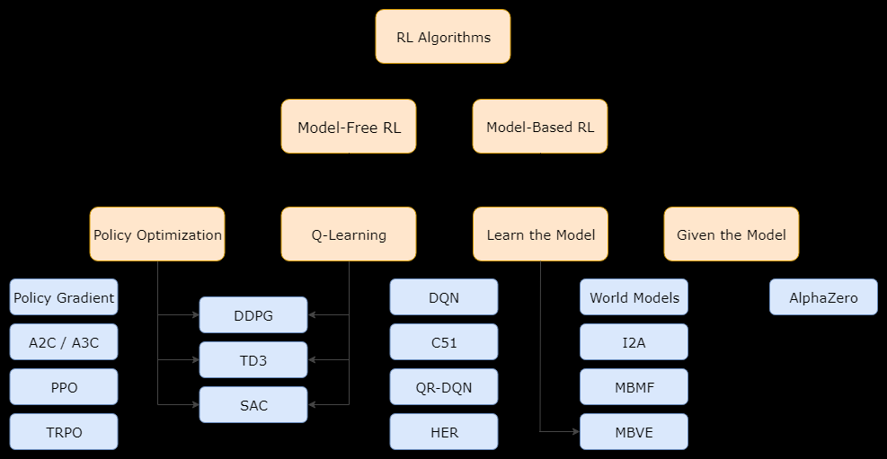

# Reinforcement Learning

Documentation and implementations for various RL models.

# RL models



# \_env Setup

```
pip install -U autopep8
pip install numpy
pip install gym
pip3 install torch torchvision torchaudio
pip install matplotlib
pip install pyglet
```

# Classic Envs

## 'CartPole-v0'

```
Observation:
    Type: Box(4)
    Num     Observation               Min                     Max
    0       Cart Position             -4.8                    4.8
    1       Cart Velocity             -Inf                    Inf
    2       Pole Angle                -0.418 rad (-24 deg)    0.418 rad (24 deg)
    3       Pole Angular Velocity     -Inf                    Inf
Actions:
    Type: Discrete(2)
    Num   Action
    0     Push cart to the left
    1     Push cart to the right
Episode Termination:
    Pole Angle is more than 12 degrees.
    Cart Position is more than 2.4 (center of the cart reaches the edge of the display).
    Episode length is greater than 200.
    Solved Requirements:
    Considered solved when the average return is greater than or equal to 195.0 over 100 consecutive trials.
```

## 'Pendulum-v1'

_Not explained on Github._
